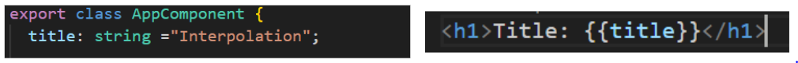

# Cours Angular

## 1. Qu'est-ce qu'Angular ?
Angular est un framework front-end basé sur **TypeScript**, développé par Google.  
Il permet de créer des applications web modernes de type **Single Page Application (SPA)** avec :  
- Une architecture modulaire  
- Des composants réutilisables  
- Une gestion efficace du **data binding**, du **routing** et des **services**  

---

## 2. Différence entre AngularJS et Angular moderne
| Aspect                  | AngularJS                   | Angular moderne            |
|-------------------------|----------------------------|---------------------------|
| Langage                 | JavaScript                 | TypeScript                |
| Architecture            | MVC                        | Basée sur des composants  |
| Performance             | Moins performant           | Plus performant           |
| CLI                     | Limitée                    | CLI puissante             |
| Modularité              | Faible                     | Avancée, pour SPA         |

---

## 3. Composant Angular
Un **composant** est une classe TypeScript avec le décorateur `@Component()` qui :  
- Regroupe le template HTML, la logique TS et les styles CSS/SCSS  
- Contrôle une partie autonome de l’interface utilisateur  

---

## 4. Décorateur @Component()
Le décorateur `@Component()` permet de :  
- Définir une classe TypeScript comme composant Angular  
- Regrouper la logique, le template et les styles en une unité réutilisable  
- Définir des attributs importants :  
  - `selector` : nom de la balise HTML  
  - `template` / `templateUrl`  
  - `styles` / `styleUrls`  
  - `providers`, `animations`, `encapsulation`, `changeDetection`  

---

## 5. Module Angular (NgModule)
Un **module Angular** est une unité logique qui regroupe composants, directives, pipes et services.  
Il sert à organiser l’application en parties modulaires et réutilisables.  

Chaque application Angular a :  
- Un **module racine** (`AppModule`)  
- Des modules fonctionnels (`SharedModule`, `FeatureModule`, etc.)  

### Points clés
- **declarations** → composants, directives et pipes du module  
- **imports** → autres modules nécessaires  
- **exports** → éléments accessibles à d’autres modules  
- **providers** → services disponibles  
- **bootstrap** → composant principal à lancer (dans le module racine)  

**Astuce :** `app.module.ts` est le module racine qui organise tous les composants et services.  

---

## 6. BrowserModule vs CommonModule
- **BrowserModule** → utilisé dans le module racine pour lancer l’application dans le navigateur  
- **CommonModule** → utilisé dans les modules enfants pour accéder aux directives de base (`*ngIf`, `*ngFor`)  

💡 BrowserModule contient déjà CommonModule, donc pas besoin de l’importer dans les modules enfants.  

---

## 7. main.ts
`main.ts` est le **point d’entrée** de l’application Angular et sert à lancer le module racine (`AppModule`) dans le navigateur.  

---

## 8. Data Binding
Le **Data Binding** permet de lier les données entre le modèle (classe TS) et la vue (template HTML) :  
- **Interpolation** (`{{ }}`) → afficher des données dans le template  

- **Property Binding** (`[property]="value"`) → lier des propriétés HTML à des variables TS  
- **Event Binding** (`(event)="method()"`) → lier des événements du template à des méthodes TS  
- **Two-way Binding** (`[(ngModel)]="variable"`) → synchroniser automatiquement la vue et le modèle  

---

## 9. Forms Angular
### Template-Driven Forms
- Formulaire construit dans le HTML  
- Angular lit les directives (`ngModel`) pour la liaison et la validation  
- Idéal pour des formulaires simples  

### Reactive Forms
- Formulaire construit dans la classe TS avec `FormGroup` et `FormControl`  
- Logique, validations et état centralisés dans le code  
- Idéal pour des formulaires complexes ou dynamiques  

---

## 10. Directive ngModel
`ngModel` permet la **liaison bidirectionnelle** (two-way binding) :  
- La valeur du champ HTML se met à jour automatiquement si la variable TS change  
- La variable TS se met à jour automatiquement si l’utilisateur modifie le champ HTML  

---

