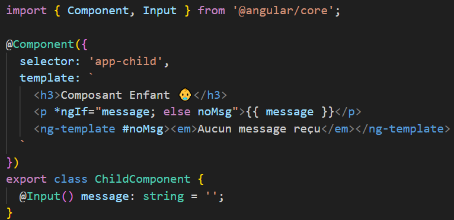
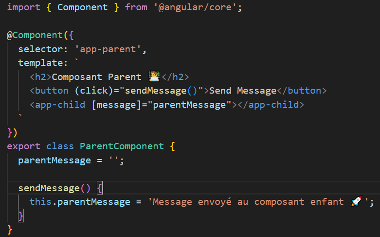
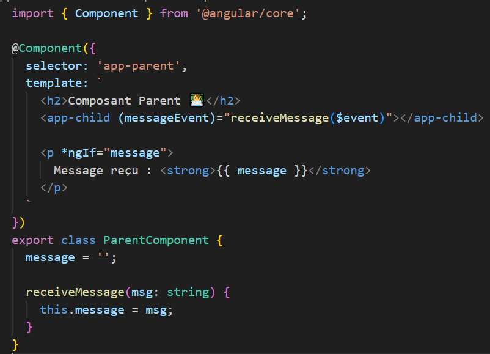
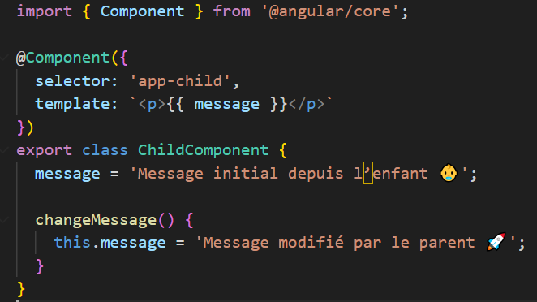
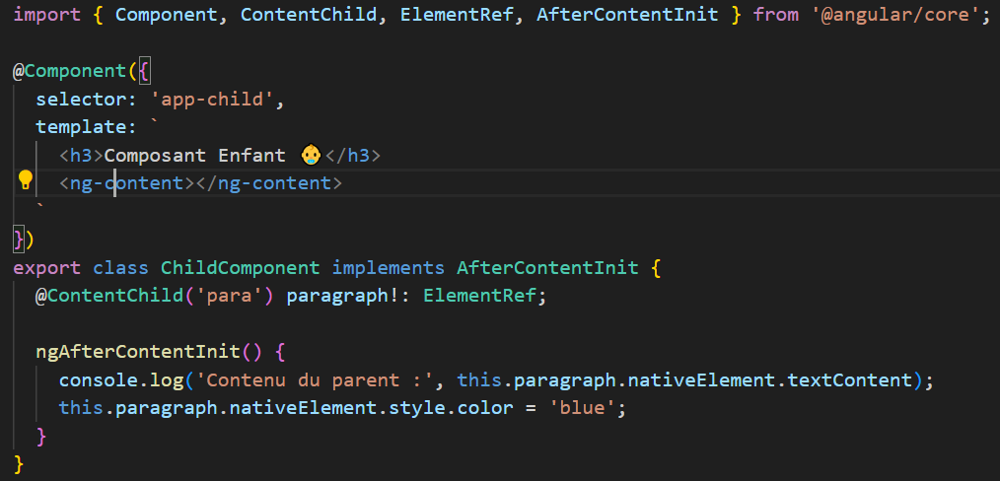
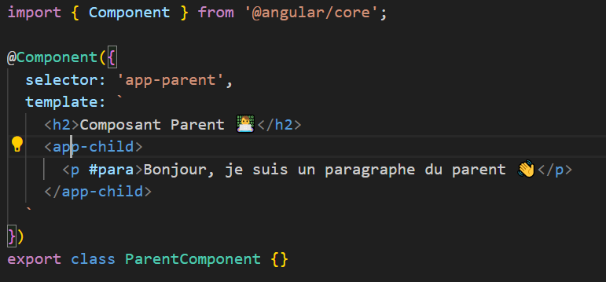

# 📚 Angular Concepts Clés

## 1) 🧱 Structure d'un composant Angular
Un composant se compose de trois éléments principaux :
- **Fichier TypeScript (.ts)** → Contient la logique du composant
- **Fichier HTML (.html)** → Contient le template (la vue)
- **Fichier CSS (.css ou .scss)** → Contient le style associé

## 2) 🔹 Communication Parent-Enfant
- **@Input()** : Permet au parent d'envoyer des données à son enfant

- **@Output()** : Permet à l'enfant d'envoyer des événements ou données à son parent

## 3) 🔹 Accès aux éléments enfants
- **@ViewChild()** : Accède à un élément/composant dans le template du composant

- **@ContentChild()** : Accède à un élément/composant passé via le contenu projeté (`<ng-content>`)

**Différence claire :**
- `@ViewChild()` → Élément dans le template interne du composant
- `@ContentChild()` → Élément dans le contenu inséré depuis le parent

## 4) 🔹 Directives Angular
### Directives Structurelles
Modifient la structure du DOM :
- `*ngIf` → Affiche/masque un élément selon une condition
- `*ngFor` → Répète un élément pour chaque item d'une liste
- `*ngSwitch` → Affiche un élément selon une valeur

### Directives d'Attribut
Modifient l'apparence ou le comportement d'un élément :
- `[ngClass]` → Ajoute/retire des classes CSS dynamiquement
- `[ngStyle]` → Applique des styles CSS dynamiquement
- `[disabled]` → Active/désactive un élément HTML

## 5) 🔹 [hidden] vs *ngIf

Caché mais présent dans le DOM

## 6)🔹 Pipes

Outil qui transforme/formate les données avant affichage :

- Transformation de dates, texte, nombres, devises

**Exemple :**
{{ date | date:'short' }}

## 7) 🔹 Composant vs Directive
- **Composant** = Directive + Template + Style
- **Directive** = Logique qui agit sur un élément existant sans template

## 8) 🔹 Change Detection
Mécanisme qui synchronise automatiquement le template avec les données du composant
